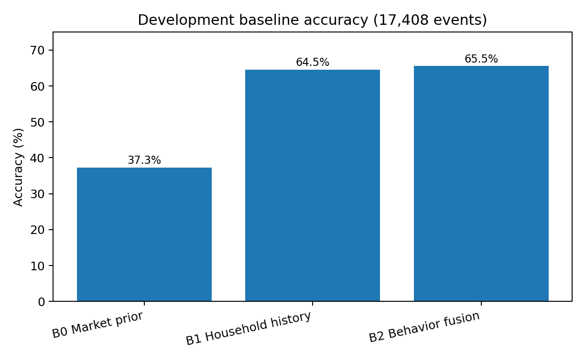
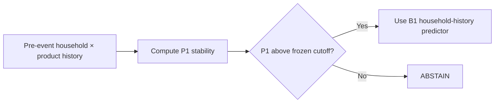
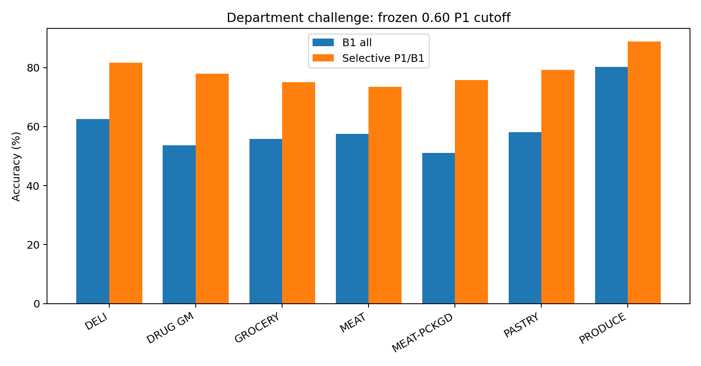

# MRSP Predictability

[Working paper](paper/MRSP_WORKING_PAPER_EN_V2_3.pdf) · [DOI](https://doi.org/10.5281/zenodo.22906259) · Repository private until owner launch approval

**Selective prediction for household product choice: know when not to predict.**

[繁體中文說明](README_zh-TW.md) · [Technical report](REPORT.md) · [Methods](docs/methods.md) · [Reproduction](docs/reproducibility.md) · [Evidence ledger](audit/RELEASE_EVIDENCE_LEDGER.md)

## What this project predicts

This repository does **not** predict whether a household will buy bread, milk, or an entire future basket.

The task is narrower and precisely defined:

> Given that a household makes a purchase inside a fixed **six-SKU choice set**, predict which of the six SKUs will be chosen.

The key finding is not only that household history helps. It is that **predictability itself can be estimated before the outcome**, allowing the system to answer only when the household × product history contains enough structure.

## Main result

A simple, frozen household-stability score (P1) was developed on 9 products and then tested on two non-overlapping batches of new product groups.

| Cohort | Evaluable products | Events | Coverage | Accuracy |
|---|---:|---:|---:|---:|
| Generalization batch 1 | 99 | 52,854 | 39.16% | 76.18% |
| Generalization batch 1 | 99 | 52,854 | 21.49% | 83.55% |
| Generalization batch 1 | 99 | 52,854 | 11.50% | 88.14% |
| Confirmatory batch 2 | 99 | 40,474 | **41.08%** | **77.17%** |
| Confirmatory batch 2 | 99 | 40,474 | **22.00%** | **84.78%** |
| Confirmatory batch 2 | 99 | 40,474 | **11.01%** | **90.06%** |

The formula and cutoffs were **not recalibrated** on the second batch.


## From a strong baseline to selective prediction

In the original 9-product development panel (17,408 forward-test events):

- B0 market prior: **37.28%**
- B1 household history: **64.53%**
- B2 behavior fusion: **65.52%**

Household history therefore produced the large step change. B2 added only a small average increment and did not clear the predeclared 3-point practical-complexity threshold used for model selection.



## The simple P1 score

Let `k` be the number of prior purchases by the household in the current six-SKU choice set.

```text
maturity = clip(log(1+k) / log(21), 0, 1)

core = 0.30*top_share
     + 0.25*(1-normalized_entropy)
     + 0.25*(1-switch_rate)
     + 0.20*recent_concentration

P1 = clip(maturity * core, 0, 1)
```

P1 has no learned coefficients and no product-specific fitted weights. It is computed only from information available before the current purchase.

## Why abstention matters

The project changed direction after repeated evidence that a single model should not be forced to predict all events. The deployed logic is therefore:



A secondary action policy can also use B0 when the market-level prior is already sufficient, but the core public result is the frozen P1 → B1 selective policy.

## Cross-department stress test

The confirmatory release also tested a deliberately non-Grocery-heavy cohort. At the frozen 60-target cutoff:

- B1 on all events: **61.18%**
- Selective P1/B1: **79.33%**
- Coverage: **40.22%**
- Predeclared ≥10-point gain rule passed in 6 of 7 departments with at least five products.



## Reproduce the result

Two levels are provided:

1. **Verify the released machine outputs** — no raw data required:
   ```bash
   python reproduce/verify_release.py
   ```

2. **Full reproduction from the same canonical CJ9 source store**:
   ```bash
   python reproduce/run_full_reproduction.py --cj9 /path/to/CJ9
   ```
   On Windows you can use:
   ```bat
   reproduce\run_all.bat C:\path\to\CJ9
   ```

The full run reconstructs the 507 pre-outcome candidate groups, reproduces the frozen first-batch exclusion, selects the second untouched representative and department-challenge cohorts using week≤22 information only, runs W1–W6 walk-forward evaluation, and compares the resulting summary to `results/EXPECTED_RESULTS.json`.

Raw transaction data are **not** included in this release; see [data release status](docs/data.md).

## Evidence discipline

This repository intentionally preserves important failed or rejected paths, including invalid early state definitions, cohort boundary bugs, unstable model routers, unsuccessful hard-case rescue, and control-isolation issues that were later repaired. See [failure history](docs/failure_history.md).

The current evidence grade is **within-panel cross-product confirmation**. See [limitations](docs/limitations.md) for the evidence scope.

## Repository map

```text
MRSP_PREDICTABILITY_RELEASE_V1.0/
├── README.md / README_zh-TW.md
├── REPORT.md / REPORT_zh-TW.md
├── CLAIMS.md
├── docs/
├── figures/
├── results/
├── reproduce/
├── src/
├── audit/
└── tests/
```

## Release status

This is the **Round 2 release**. Round 3 is reserved for an independent release audit, fresh-reproducer simulation, claim-to-evidence audit, and final V1.0 sealing.
