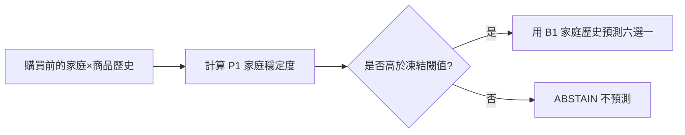

# MRSP Predictability（MRSP 可預測性研究）

**家庭商品選擇的選擇性預測：先判斷什麼時候不該預測。**

[English README](README.md) · [繁體中文技術報告](REPORT_zh-TW.md) · [方法](docs/methods_zh-TW.md) · [復現](docs/reproducibility_zh-TW.md) · [證據總帳](audit/RELEASE_EVIDENCE_LEDGER.md)

## 這個專案究竟預測什麼？

目前的成果**不是**預測某家庭下一次會不會買麵包／牛奶，也不是預測下一整個購物籃。

任務是：

> 已知某家庭這一次會在一個固定的**六個 SKU（庫存單位）選擇集合**中發生購買，預測六個 SKU 中會選哪一個。

真正的重要發現不是只有「家庭歷史有用」，而是：**在結果發生以前，可以先估計這個家庭 × 商品事件是否值得預測。**

## 核心結果

P1（家庭穩定度）先在9個開發商品形成，之後公式與閾值凍結，再進入兩批互不重疊的新商品。

| 樣本 | 可評估商品 | 事件數 | Coverage（覆蓋率） | Accuracy（準確率） |
|---|---:|---:|---:|---:|
| 第一批泛化 | 99 | 52,854 | 39.16% | 76.18% |
| 第一批泛化 | 99 | 52,854 | 21.49% | 83.55% |
| 第一批泛化 | 99 | 52,854 | 11.50% | 88.14% |
| 第二批確認 | 99 | 40,474 | **41.08%** | **77.17%** |
| 第二批確認 | 99 | 40,474 | **22.00%** | **84.78%** |
| 第二批確認 | 99 | 40,474 | **11.01%** | **90.06%** |

第二批沒有重新學習 P1，也沒有重新調閾值。


## 從市場平均到家庭歷史

最初9個商品、17,408個前向測試事件：

- B0 市場先驗：**37.28%**
- B1 家庭歷史：**64.53%**
- B2 行為融合：**65.52%**

最大的提升來自家庭自己的購買歷史。B2 在 B1 之上再加入上一個選擇、連續購買、近期選擇份額、距上次選擇時間等近期行為資訊；它有小幅真實增益，但沒有通過事前設定的 3 個百分點實用複雜度門檻，因此公開系統保留較簡單的 B1。

## P1 公式

令 `k` 為家庭在目前六選一商品組中，當前事件以前的累積購買次數：

```text
maturity = clip(log(1+k) / log(21), 0, 1)

core = 0.30*top_share
     + 0.25*(1-normalized_entropy)
     + 0.25*(1-switch_rate)
     + 0.20*recent_concentration

P1 = clip(maturity * core, 0, 1)
```

P1 沒有學習式係數，也沒有商品專屬權重；全部欄位只能使用當前購買發生以前的歷史。

## 為什麼 ABSTAIN（不預測）很重要？



因此約40%／22%／11%不是客戶比例，而是模型願意作答的**可評估家庭×商品購買事件比例**。

## 跨部門壓力測試

在另一組刻意降低 Grocery（雜貨）占比的100商品壓力樣本中，凍結 60-target P1 閾值：

- 全部 B1：**61.18%**
- 選擇性 P1/B1：**79.33%**
- Coverage：**40.22%**
- 7個至少有5商品的部門中，6個通過事前設定的 ≥10pp 選擇性提升門檻。

## 如何復現

### 只驗證公開機器輸出

```bash
python reproduce/verify_release.py
```

### 使用相同 canonical CJ9（標準資料庫）完整重跑

```bash
python reproduce/run_full_reproduction.py --cj9 /path/to/CJ9
```

Windows：

```bat
reproduce\run_all.bat C:\path\to\CJ9
```

原始逐筆交易資料暫不包含在公開候選包中；原因與資料結構見 `docs/data_zh-TW.md`。

## 證據等級

目前可以稱為 **CONFIRMED_WITHIN_PANEL_CROSS_PRODUCT（同一面板內跨商品確認）**。這表示在同一資料生態內，凍結規則已在兩批互不重疊的新商品與跨部門壓力樣本上重現。證據範圍與限制詳見 `docs/limitations_zh-TW.md`。
