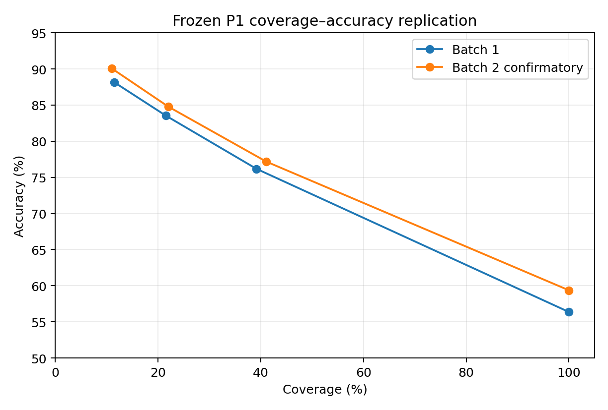

# MRSP Predictability


[Working paper](paper/MRSP_WORKING_PAPER_EN_V2_3.pdf) · [DOI](https://doi.org/10.5281/zenodo.22906259) · Repository public following owner launch approval


**Selective prediction for household product choice: know when not to predict.**


[繁體中文說明](README_zh-TW.md) · [Technical report](REPORT.md) · [Methods](docs/methods.md) · [Reproduction](docs/reproducibility.md) · [Evidence ledger](audit/RELEASE_EVIDENCE_LEDGER.md)


## What this project predicts


This repository does **not** predict whether a household will buy bread, milk, or an entire future basket.


The task is narrower and precisely defined:


> Given that a household makes a purchase inside a fixed **six-SKU choice set**, predict which of the six SKUs will be chosen.


The key finding is not only that household history helps. It is that **predictability itself can be estimated before the outcome**, allowing the system to answer only when the household × product history contains enough structure.


## Main result


A simple, frozen household-stability score (P1) was developed on 9 products and then tested on two non-overlapping batches of new product groups.


| Cohort | Evaluable products | Events | Coverage | Accuracy |
|---|---:|---:|---:|---:|
| Generalization batch 1 | 99 | 52,854 | 39.16% | 76.18% |
| Generalization batch 1 | 99 | 52,854 | 21.49% | 83.55% |
| Generalization batch 1 | 99 | 52,854 | 11.50% | 88.14% |
| Confirmatory batch 2 | 99 | 40,474 | **41.08%** | **77.17%** |
| Confirmatory batch 2 | 99 | 40,474 | **22.00%** | **84.78%** |
| Confirmatory batch 2 | 99 | 40,474 | **11.01%** | **90.06%** |


The formula and cutoffs were **not recalibrated** on the second batch.





## From a strong baseline to selective prediction


In the original 9-product development panel (17,408 forward-test events):


- B0 market prior: **37.28%**
- B1 household history: **64.53%**
- B2 behavior fusion: **65.52%**


Household history therefore produced the large step change. B2 added only a small average increment and did not clear the predeclared 3-point practical-complexity threshold used for model selection.


## The simple P1 score


Let `k` be the number of prior purchases by the household in the current six-SKU choice set.


```text
maturity = clip(log(1+k) / log(21), 0, 1)


core = 0.30*top_share
     + 0.25*(1-normalized_entropy)
     + 0.25*(1-switch_rate)
     + 0.20*recent_concentration


P1 = clip(maturity * core, 0, 1)
